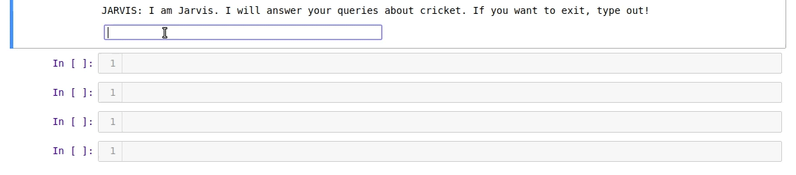

# Simple Chatbot which answer Cricket related queries
 Simple Chatbot using NLTK
 
 
## Dependencies
* Scikit learn
* NLTK

## Dataset
* Chat.text is used as corpus in this project and it contains text from wikipedia pages related to cricket

## Files description
 * Chat.text : It is used as corpus for the project
 * Chatbot.ipynb : It ipython jupyter notebook containing chatbot code.
 
 ## License & copyright
 © Rahul Kumar  
 Licensed under the [MIT License](LICENSE)
